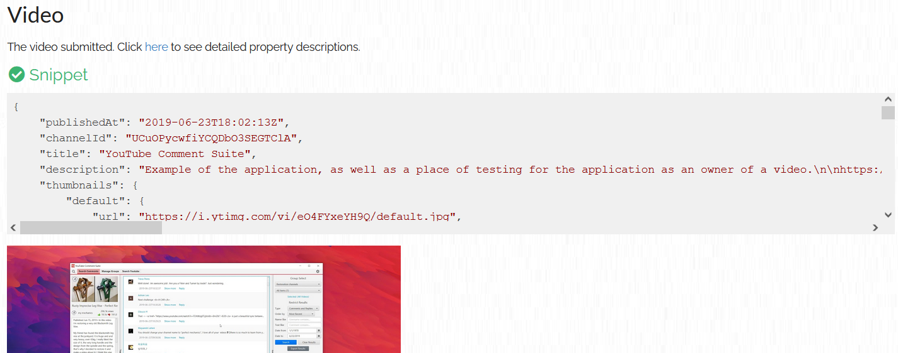

# YouTube Metadata

A quick way to gather all the metadata about a video, playlist, or channel from the YouTube API.

- https://mattw.io/youtube-metadata/
- https://mattw.io/youtube-metadata/bulk

What's unique about this tool? How can you use it?

1. If you're curious about a video and its author, playlist and its creator, or channel
2. If you're curious about an entire playlist's videos or channel's videos
3. Use it as an API-explorer
   - Grabs every part available
   - Provides shareable link
4. Use it for investigative purposes and OSINT
   - Tells you what if found and what it didn't find
   - Auto-translations of language and country codes
   - Geolocation direct link to Google Maps
   - Interpretation and display of meaningful fields
   - Reverse image search thumbnails
5. Export and import
   - Save data as a zip
   - Import zip to view in app again later
   - Both raw json data from the api and csv from the tables

## Build

Refer to [BUILD.md](https://github.com/mattwright324/youtube-metadata/blob/master/BUILD.md)
for instructions on how to build and run from source.

## Contributing

Contributions are welcome, refer
to [CONTRIBUTING.md](https://github.com/mattwright324/youtube-metadata/blob/master/CONTRIBUTING.md)
for more detail.
